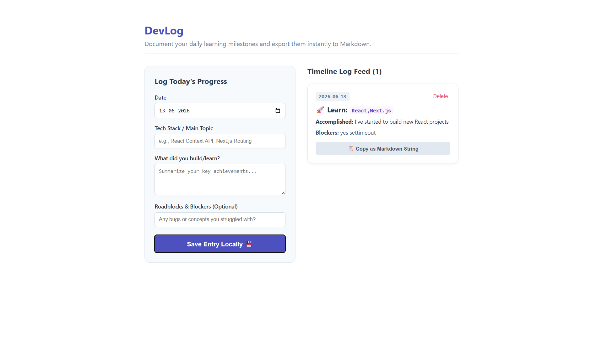

#  DevLog — Daily Technical Journal Utility
------------------------------------------------

DevLog is a responsive developer productivity engine built with React that automates creating unified documentation timelines. It provides a structured workflow to track technical summaries, log features built, isolate development blockers, and export perfectly styled Markdown scripts ready for GitHub updates.

##  Project Core Capabilities
*  **Persistent Session Tracking:** Connects data arrays directly into browser `localStorage` parameters to preserve text state across sessions.
*  **Structured String Compilers:** Converts object definitions smoothly into formatted Markdown strings with a single click.
*  **Adaptive UI Shells:** Dynamically handles state to render elements based on data inputs.

## Live Preview
* 

## Working Setup Instructions
1. Setup packages: `npm install`
2. Run local ecosystem: `npm run dev`